---

## 👨‍💻 About Me

- 🎓 Computer science student focused on backend development and software engineering
- 🌱 Currently learning **FastAPI**, **SQLAlchemy**, authentication with **JWT**, and database integration
- 🔨 Building practical projects to sharpen my skills and write clean, maintainable code
- 🎯 Working towards becoming a backend developer

---

## 🛠️ Tech Stack

**Languages**

**Backend**

**Databases**

**Tools**

---

## 🚀 Featured Projects

| Project | Description | Tech |
|---|---|---|
| [**Weather Application**](https://github.com/SamiKhan43/Weather_Application) | Desktop app that shows current weather and forecasts for any city using real-time data | Python, PyQt5 |
| [**Broadcast Server (CLI)**](https://github.com/SamiKhan43/Broadcast-Server-CLI) | TCP server that handles multiple concurrent clients and broadcasts messages in real time | Python, Sockets, Threading |
| [**API Projects (CLI)**](https://github.com/SamiKhan43/API_PROJECTS_CLI) | Collection of projects that fetch, process and display data from real-world APIs | Python, REST APIs |
| [**File Manager**](https://github.com/SamiKhan43/file-manager) | Menu-driven console app to list, create, delete, rename, copy and move files and folders | Python |
| [**Number Guessing Game**](https://github.com/SamiKhan43/Number-guessing_game) | Guess a randomly generated number within a range | Python |

---

## 📊 GitHub Stats

---

## 📫 Let's Connect

I'm open to learning opportunities, collaboration on backend projects, and feedback on my code. The best way to reach me is by [email](mailto:qwertynoob456@gmail.com), or find me on [X](https://x.com/khan_sami88006) and [Instagram](https://instagram.com/samiiiii_560).

