<div align="center">



</div>

<br/>

## 👨‍💻 About Me

```python
class Samiullah:
    role = "Computer Science Student"
    languages = ["Python", "C++", "JavaScript"]
    learning = ["FastAPI", "SQLAlchemy", "JWT", "Databases"]
    building = "Backend projects and REST APIs"
    goal = "Backend Developer"

    def say_hi(self):
        return "Always learning, building, and improving."
```

<br/>

## 🛠️ Tech Stack

<div align="center">


</div>

<br/>

## 🚀 Featured Projects

<div align="center">

<a href="https://github.com/SamiKhan43/Expense-Tracker-API">  </a>
<a href="https://github.com/SamiKhan43/Weather_Application">  </a>
<a href="https://github.com/SamiKhan43/Broadcast-Server-CLI">  </a>
<a href="https://github.com/SamiKhan43/file-manager">  </a>

</div>

<br/>

## 📊 GitHub Statistics

<div align="center">

<a href="https://github.com/SamiKhan43">
  
</a>
<a href="https://github.com/SamiKhan43">
  
</a>

<br/>


<br/><br/>

### Contribution Activity


</div>


<br/>

## 📫 Let's Connect

I'm interested in backend development, Python, APIs, and building practical projects. Feel free to reach out if you'd like to discuss a project, share ideas, or connect.

[Email](mailto:qwertynoob456@gmail.com) · [X](https://x.com/khan_sami88006) · [Instagram](https://instagram.com/samiiiii_560)

<br/>


